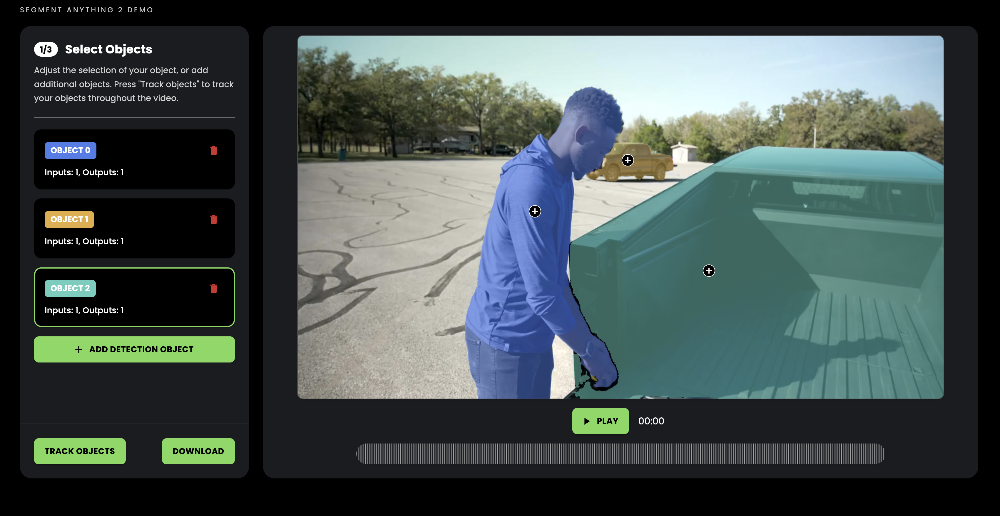

# SAM2 Demo Project

This project provides an open-source implementation of the Segment Anything 2 (SAM2) demo. It consists of a FastAPI backend that can run on GPU-enabled servers and a React-based frontend for interaction.
It runs on g4dn.xlarge instance using an Nvidia T4 for around $0.50/h.



**Note:** This is a work in progress. Contributions are welcome!

## Project Structure

```
.
├── backend/
├── frontend/
└── README.md
```

## Backend Setup

### Prerequisites

- Python 3.8+
- CUDA-compatible GPU (e.g., NVIDIA T4)
- Git

### Installation

1. Clone this repository:
   ```
   git clone https://github.com/streamfog/sam2-app
   cd sam2-app/backend
   ```

2. Install the required Python packages:
   ```
   pip install -r requirements.txt
   ```

3. Clone my SAM2 fork repository:
   ```
   git clone https://github.com/streamfog/segment-anything-2
   ```

4. Download the SAM2 model weights and model configs.

### Running the FastAPI Server

To start the FastAPI server:

```
uvicorn main:app --host 0.0.0.0 --port 8000
```

### Making FastAPI Accessible

To make your FastAPI server accessible from the internet:

1. Set up Nginx as a reverse proxy:
   ```
   sudo apt-get install nginx
   ```

2. Configure Nginx (edit `/etc/nginx/sites-available/default`):
   ```nginx
   server {
       listen 80;
       server_name your_domain.com;

       location / {
           proxy_pass http://localhost:8000;
           proxy_set_header Host $host;
           proxy_set_header X-Real-IP $remote_addr;
       }
   }
   ```

3. Restart Nginx:
   ```
   sudo systemctl restart nginx
   ```

4. Set up a systemd service for your FastAPI app (create `/etc/systemd/system/sam2demo.service`):
   ```
   [Unit]
   Description=SAM2 Demo FastAPI
   After=network.target

   [Service]
   User=your_username
   WorkingDirectory=/path/to/your/backend
   ExecStart=/usr/local/bin/uvicorn main:app --host 0.0.0.0 --port 8000
   Restart=always

   [Install]
   WantedBy=multi-user.target
   ```

5. Start and enable the service:
   ```
   sudo systemctl start sam2demo
   sudo systemctl enable sam2demo
   ```

## Frontend Setup

1. Navigate to the frontend directory:
   ```
   cd ../frontend
   ```

2. Install dependencies:
   ```
   npm install
   ```

3. Update the backend endpoint:
   Open `src/VideoPlayer.tsx` and update the `HOST_ADRESS` variable to point to your FastAPI endpoint.

4. Start the development server:
   ```
   npm start
   ```

## Contributing

Contributions to improve this demo are welcome! The biggest problem right now is that I couldn't find a way to completely free up memory after a session is deleted.
That will inevitably lead to an OOM error on the ec2 instance. That's why I didn't bother to really do session management so it can be hosted and used by multiple people.

Please feel free to submit pull requests or open issues to discuss potential improvements.

## License

[Apache License 2.0](LICENSE)